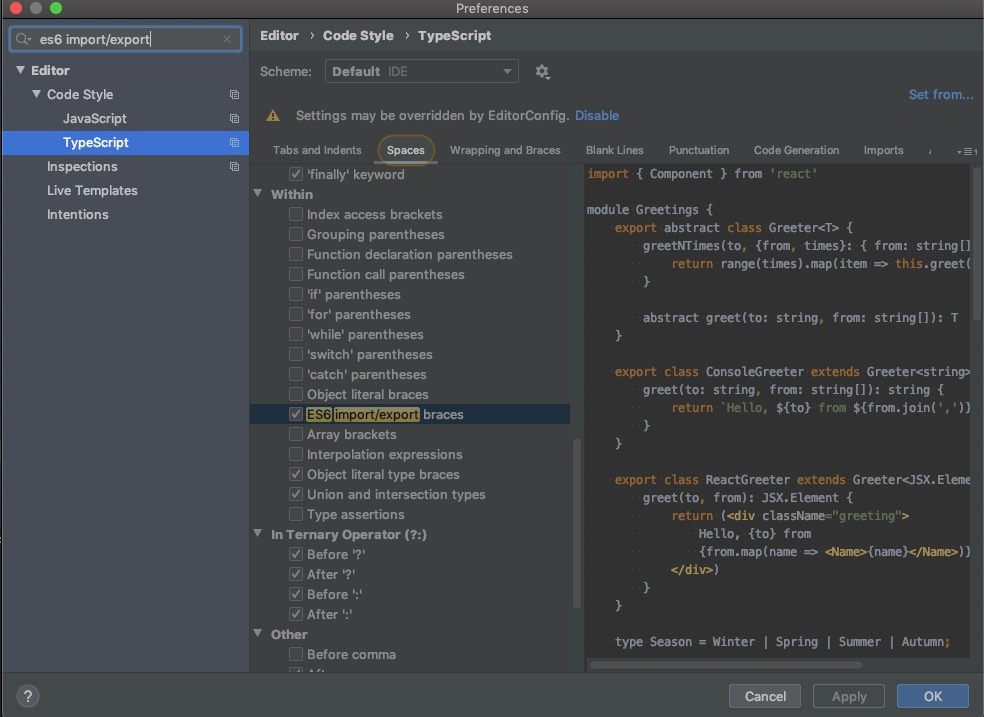

# Building a new frontend app from scratch -- Sharing my experience from creating the web crawler UI

While adding new features to existing projects is something we do on a daily basis as developers,
not too many of us have the experience of building a brand new frontend app from scratch.
Building a new Vendasta frontend app from ground up is a task that I have never done in my career
and I think it would be worthwhile to compose a blog sharing such an experience.
In this post, I mainly focus on what I did to set up cloudbuild and add authentication to this new app.


## Setting up github code repository and cloudbuild
In order to generate a brand new github code repository under Vendasta, we may need to get help from
the SRE team. In this step, you may need to provide a project name and typically for a frontend app,
the name should be `<µs-app-name>-client` where `<µs-app-name>` is the project name of the corresponding microservice.
While most of the work would be handled by the SRE team, there are several files you
may need to provide by yourself.

1. `cloudbuild.yml` for cloud build to automatically build your app and send you notification through Mission Control
so that you can deploy.

    - Since the app I'm building is an internal UI tool similar to
    the [admin page](https://admin.vendasta-internal.com),
    I can copy the content of `vendasta-center-client/cloudbuild.yml`
    and change certain spots to make it my own. Likewise, if you are
    building a customer-face app, find one existing frontend project and
    re-use its `cloudbuild.yml`.
    
1. `frontend.yaml` to specify how we will deploy the frontend
container but in our case the content is rather simple. 

    - In this file, you may just need to provide one line
    
        ```yml
        app_id: some-app-name
        ```     
   
1. `service-level` to mainly tell which team owns this project

    - In this file you may just need to add the following content
    
        ```yml
         services:
           - name: <project-name>
             platform: "Frontend: Angular"
             language: typescript
             availability: 0
             owner: <team-name>
        ```

## Authentication
Since it's an internal tool, we give access only to Vendasta users and we can do this through
the Google login. It might also be nice to have an atlas navigation bar to indicate who is currently
logged in and make sure they can logout. The followings are what you'll need for this step
and I've put links to their corresponding examples.

### [Auth service](https://github.com/vendasta/web-crawler-client/blob/master/src/app/auth/auth.service.ts)

If the app gives access to only admin users, you may need to specify the scope to admin in the
basic config as in the following code snippet:
```typescript
const baseAuthConfig = {
   scope: ['admin'].join(' '),

   strictDiscoveryDocumentValidation: false,
   skipIssuerCheck: true,

   // use silent refresh rather than refresh token
   useSilentRefresh: true,

   responseType: 'code',
};
```

If you do specify the scope to admin in your frontend app,
you'll also need to change the service API to have
the scope set to admin as well. Here's an example you may follow
in your `vendastaapis` proto:
```go
service ScraperService {
   rpc Create(CreateScraperRequest) returns (google.protobuf.Empty){
       option (vendastatypes.access) = {
         scope: "admin"
       };
   };
   rpc Update(UpdateScraperRequest) returns (google.protobuf.Empty){
       option (vendastatypes.access) = {
         scope: "admin"
       };
   };
   rpc List(ListScraperRequest) returns (ListScraperResponse){
       option (vendastatypes.access) = {
         scope: "admin"
       };
   };
}
```

Use silent refresh and here's a good explanation from Jason Prokop:

   - With silent refresh, the main application accomplishes retrieving fresh token
   for the user with zero user interaction or page navigation.
   
   - The angular library does the followings:
   
       - Opens an iframe directed at the SSO auth URL
       (with parameters indicating zero user interaction
       -- now produces errors about interaction when met)
       
       - iframe gets redirected to the silent refresh URL
       (specified in previous step’s request)
       for authenticated and consenting user with code for token exchange
       
       - iframe renders silent refresh html
       which sends code to main application window
       - main application exchanges code for fresh token
       
### Other necessary services or components
1. [Environment service](https://github.com/vendasta/web-crawler-client/blob/master/src/app/common/environment.service.ts)

1. [HTTP interceptor](https://github.com/vendasta/web-crawler-client/blob/master/src/app/access/interceptor.ts)

1. [Logout component](https://github.com/vendasta/web-crawler-client/tree/master/src/app/logout)


### Nice to have
[Atlas component](https://github.com/vendasta/web-crawler-client/tree/master/src/app/atlas)


## Redirection between auth and app pages with different environments
The app should operate in a given environment (e.g., local, demo, prod, test, etc.) and
make network calls based on the environment. The environment would then make different
for things such as authentication tokens so that everything is aligned;
e.g., if I'm running the frontend locally or accessing the demo app,
the app should make API calls to the demo
endpoints and get data from vStore demo with a demo bearer token.
So how do we do that?
In your `index.html` file, **never ever** forget about the following commented out lines:

```html
<!-- vStaticInject:environment -->
<!-- vStaticInject:deployment -->
<!-- vStaticInject:iam -->
```

why? According to Graham:
When you run `fecli deploy` you are sending off all of your build artifacts to vstatic;
then when you go to your app in the browser, vstatic serves those files.
But right before it serves `index.html` it checks for those html comments to see
if they're there and if they are it just replaces them with the pertinent information.

## Server setup to serve the frontend app

In order to establish a connection between your frontend app and microservice, you may need
to add some code in your microservice and here's a good example you can take:

```go
// Handler for UI client
grpcJSONTranscodedServer := serverconfig.CORS(bifrost.Wrap(grpcServer, strconv.Itoa(HTTPPort)))
mux.Handle("/web_crawler.v1.ScraperService/", grpcJSONTranscodedServer)
mux.HandleFunc("/", c.GetIndexHTMLHandler(ctx, func(r *http.Request) (string, error) { return "", nil }))
```

In the above example, the `ScraperService` handles the API endpoints that
I wish to call from the current phase of my frontend; e.g., `List`, `Create` and `Update`.


## Setup service provider

### Register service provider (_repeat it for prod as the example is for demo_)

```shell script
curl --location --request POST 'https://sso-api-demo.vendasta-internal.com/sso.v1.ServiceProviderAdmin/CreateServiceProvider' \
--header 'content-type: application/json' \
--header 'authorization: Bearer <bear token>' \
--data-raw '{
    "service_provider": {
    "entry_url": "https://<your_app-name>-demo.apigatway.co/",
    "owned_and_operated": true,
    "primary_domain": "https://<your_app_name>-demo.apigatway.co/",
    "service_provider_id": "<your_service_provider_id>",
    "session_url": "",
    "logout_url": ""
    }
}'
```

### Obtain client IDs (_repeat for prod as the example is for demo_)

```shell script
curl --location --request POST 'https://sso-api-demo.apigateway.co/sso.v1.ServiceProviderAdmin/CreateConfig' \
--header 'Content-Type: application/json' \
--header 'authorization: Bearer <bear token>' \
--data-raw '{
    "name": "web-crawler-client",
    "service_provider_id": "<your_service_provider_id>",
    "redirect_uris": ["https://<your_app_name>-demo.vendasta-internal.com"]
}'
```
   
Grab the client ID from here and use it in the next step.

### Update redirect URLs for service provider (_repeat for prod and get rid of_ `localhost` _as the example is for demo_)

```shell script
curl --location --request POST 'https://sso-api-demo.vendasta-internal.com/sso.v1.ServiceProviderAdmin/UpdateConfig' \
--header 'content-type: application/json' \
--data-raw '{
    "mutations": [
        {
            "redirect_uris": {
                "repeated_string": ["http://localhost:4200", "https://<your_app_name>-demo.vendasta-internal.com"]
            }
        }
    ],
    "client_id": "<client_id>"
}'
```

The above three endpoint calls to the SSO µs are probably the most critical ones you may need
to make for this step. You may find more details
[here](https://github.com/vendasta/sso/blob/master/docs/frontend-auth/README.md).


## Code format

### Prettier
Prettier may save you a significant amount of time to organize your code and
[here](https://www.jetbrains.com/help/webstorm/prettier.html) is a good spot
for you to setup prettier for your WebStorm IDE.
Also, you may need to add the following JSON condig in your `paackage.json`:

```json
"prettier": {
"singleQuote": true,
"printWidth": 120,
"useTabs": false,
"tabWidth": 4,
"semi": true,
"bracketSpacing": true
}
```

### WebStorm import settings
You may find it painful to manually type in whitespaces for each line of imports
to make it look like `import { X, Y } from '@some/library';`.
But you can save your time on this by adding the following setting to your WebStorm:

1. open your WebStorm preference by pressing `command ,`;

1. type in `es6 import/export` in the search bar and select typescript;

1. check ES6 import/export braces

The following screenshot may better help you with this.


## Acknowledgements
Special thanks go out to Taylor Wiebe (for helping me go through
the auth process),
Graham Holtslander (for expert frontend opinions),
Jason Prokop (for the help with silent refresh),
Jonathan Baxter (for helping me with everything)
as well as the remainder of the data team for welcoming me 
and for walking me through what we do in this team.